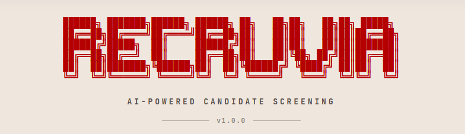
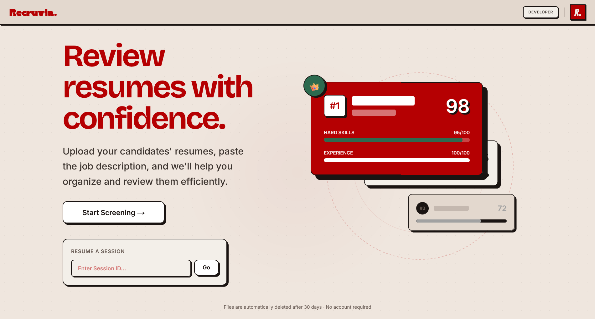

<div align="center">

<div align="center">
  
</div>
</br>


<div align="center">

[](https://git.io/typing-svg)

</div>

---

<div align="center">
  <a href="#">
    
  </a>
    
</div>
<br>


</div>

---

### Dashboard Preview

<div align="center">
  
</div>

<br/>

---

### Upload. Parse. Rank.

*Recruvia is a premium, high-performance web application designed to automate the grueling process of resume screening. Built with a modern **neobrutalist** aesthetic, it empowers hiring managers to upload batches of candidate resumes, provide a Job Description, and instantly receive intelligent, structured rankings driven by Google's Gemini 2.0 AI.*

<br>

<table>
<tr>
<td width="25%" valign="top">

**AI Engine**
`Gemini 2.0 Flash`

Deep contextual understanding with strict Zod JSON schema enforcement

</td>
<td width="25%" valign="top">

**Parsing**
`Multi-Format`

Flawlessly extracts raw text from PDF, DOC, DOCX, and TXT files securely

</td>
<td width="25%" valign="top">

**Performance**
`Real-time SSE`

Live parsing and scoring updates via Server-Sent Events

</td>
<td width="25%" valign="top">

**Security**
`Audit Hardened`

Protected against prompt injections, path traversals, and MIME spoofing

</td>
</tr>
</table>

> **What makes Recruvia different**
> - Premium "Cherry Vanilla" Neobrutalist design system
> - Real-time processing streams, never stare at a frozen loading bar
> - AI decisions based on deep context, not simple keyword matching
> - Built with Next.js 15, Prisma, PostgreSQL, and Gemini API

<br/>

---

<div align="center">

[](#)&nbsp;&nbsp;[](https://github.com/Prathmesh-D/Recruvia.git)&nbsp;&nbsp;[](https://github.com/Prathmesh-D/Recruvia/issues)

</div>

---

### What it does

<table width="100%">
  <tr>
    <td width="50%" valign="top" style="padding: 16px; border: 1px solid #d0d7de; border-radius: 10px;">
      <h3>Deep Candidate Parsing</h3>
      Upload batches of resumes (up to 50 at a time). Recruvia safely extracts the text and prepares it for analysis without executing malicious payloads.
    </td>
    <td width="4%"></td>
    <td width="50%" valign="top" style="padding: 16px; border: 1px solid #d0d7de; border-radius: 10px;">
      <h3>Intelligent Job Matching</h3>
      Paste or upload your Job Description. The AI engine cross-references every candidate's experience against your exact requirements.
    </td>
  </tr>
  <tr><td colspan="3" height="10"></td></tr>
  <tr>
    <td width="50%" valign="top" style="padding: 16px; border: 1px solid #d0d7de; border-radius: 10px;">
      <h3>Real-Time Scoring Dashboard</h3>
      Watch the rankings update live. Candidates are scored from 0-100 with distinct "Match", "Partial", or "Miss" badges across specific required skills.
    </td>
    <td width="4%"></td>
    <td width="50%" valign="top" style="padding: 16px; border: 1px solid #d0d7de; border-radius: 10px;">
      <h3>Actionable Explanations</h3>
      No black-box AI. Click on any candidate to see exactly *why* they received their score, along with missing requirements and extracted metadata.
    </td>
  </tr>
  <tr><td colspan="3" height="10"></td></tr>
  <tr>
    <td width="50%" valign="top" style="padding: 16px; border: 1px solid #d0d7de; border-radius: 10px;">
      <h3>Beautiful Neobrutalist UI</h3>
      A striking, premium "Cherry Vanilla" interface featuring stark borders, vibrant reds, and micro-interactions powered by Framer Motion.
    </td>
    <td width="4%"></td>
    <td width="50%" valign="top" style="padding: 16px; border: 1px solid #d0d7de; border-radius: 10px;">
      <h3>Export & Persist</h3>
      Export the final ranked candidate list to CSV. All sessions are persisted in a PostgreSQL database so you can revisit past hiring rounds.
    </td>
  </tr>
</table>

<br/>

---

### Get started in 60 seconds

<table width="100%" cellspacing="0" cellpadding="0">
  <tr>
    <td width="36" valign="top" align="center">
      <strong>1</strong>
    </td>
    <td valign="top" style="padding-left: 12px;">
      <strong>Clone & Install Dependencies</strong><br><br>
      <code>git clone https://github.com/Prathmesh-D/Recruvia.git</code><br>
      <code>npm install</code><br><br>
      Recruvia uses Next.js 15 and Tailwind v4. The package manager will set up everything you need.<br><br>
    </td>
  </tr>
  <tr><td colspan="2" height="20"></td></tr>
  <tr>
    <td width="36" valign="top" align="center">
      <strong>2</strong>
    </td>
    <td valign="top" style="padding-left: 12px;">
      <strong>Configure Environment</strong><br><br>
      Copy the environment template:<br>
      <code>cp .env.example .env</code><br><br>
      Add your <code>DATABASE_URL</code> (PostgreSQL) and your <code>GOOGLE_API_KEY</code> for the Gemini AI Engine.<br><br>
    </td>
  </tr>
  <tr><td colspan="2" height="20"></td></tr>
  <tr>
    <td width="36" valign="top" align="center">
      <strong>3</strong>
    </td>
    <td valign="top" style="padding-left: 12px;">
      <strong>Sync DB & Launch</strong><br><br>
      <code>npx prisma db push</code><br>
      <code>npm run dev</code><br><br>
      Open <code>localhost:3000</code> in your browser. You're ready to start screening.
    </td>
  </tr>
</table>
<br/>

---

### Project structure
<br>

```
Recruvia/
│
├── src/app/                   ⚛️ Next.js 15 App Router
│   ├── api/v1/                Serverless API routes & Server-Sent Events
│   ├── session/               Dynamic routing for active hiring sessions
│   └── developer/             Developer portfolio & architecture docs
│
├── src/components/            🎨 Neobrutalist UI components
│   ├── ui/                    Base elements (Buttons, Inputs, Toasts)
│   └── (feature components)   ResumeDropzone, CandidateDrawer, ScoreBar
│
├── src/lib/                   ⚙️ Core business logic
│   ├── gemini.ts              AI Prompts & Zod Schema enforcements
│   ├── prisma.ts              Database ORM singleton
│   ├── fileParser.ts          PDF/DOCX/TXT extraction logic
│   └── store.ts               Zustand global state management
│
└── prisma/                    🗄️ Database
    └── schema.prisma          PostgreSQL relational schema
```

<br/>

---

<div align="center">


Built by **[Prathmesh Deshkar](https://github.com/Prathmesh-D)**

*If it was useful or interesting, a star is always appreciated.*

[](https://github.com/Prathmesh-D/Recruvia/stargazers)

---
</div>
